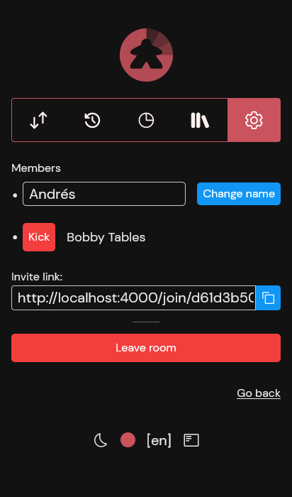
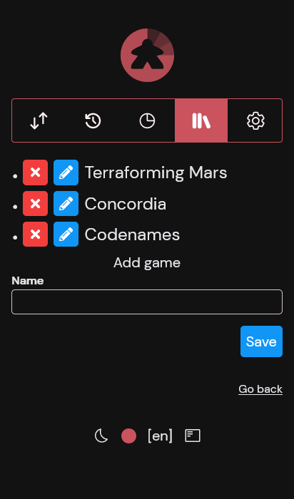
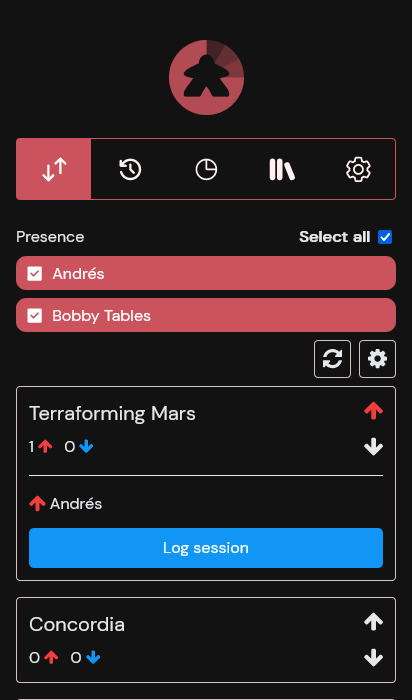
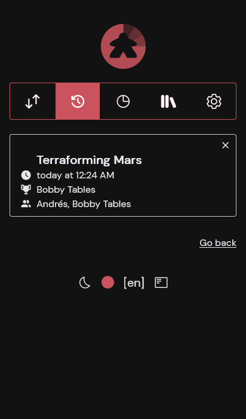
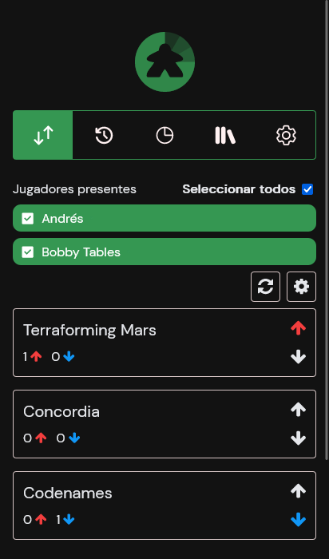
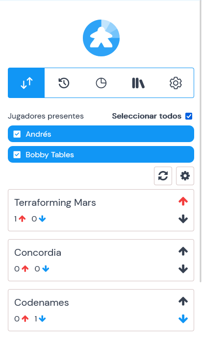

# Poll20

    

    Ash + Phoenix + Vue board game voting and logging app

    
    
    
    
    
    

## Server
Regular Phoenix server https://hexdocs.pm/phoenix/up_and_running.html + Ash https://www.ash-hq.org/docs/guides/ash/latest/tutorials/get-started (+ AshJsonApi + AshPostgres)

TL;DR setup:
* install elixir (e.g. through asdf)
* setup postgres with credentials as specified in `config/dev.exs`
* run `mix setup`

TL;DR run:
* start postgres, e.g. `sudo service postgresql start`
* boot with `mix phx.server`, or play in interactive shell with `iex -S mix`

## Client
Vue3 + Vite app (Vitesse starter template). Lives on `assets/`, compiles to `priv/static`. Develop with `pnpm dev`, build with `pnpm build`.