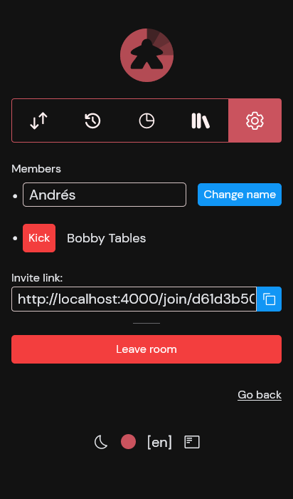
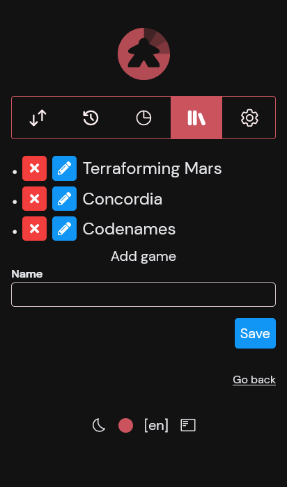
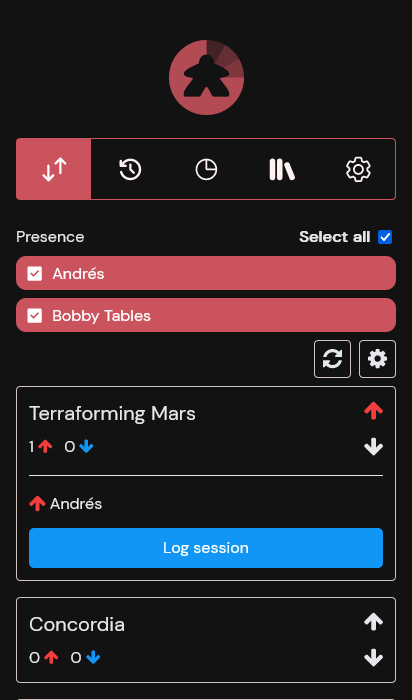
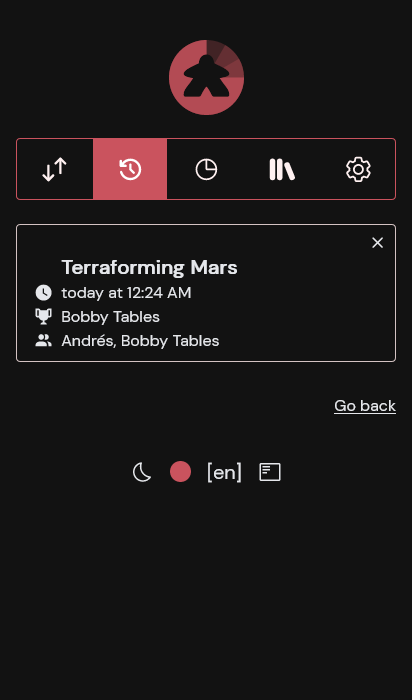
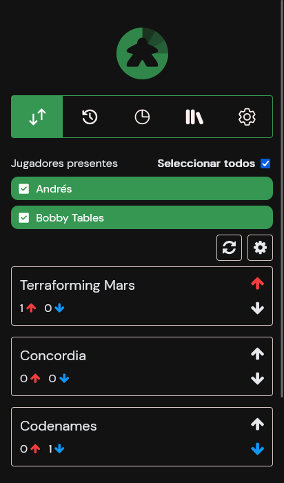
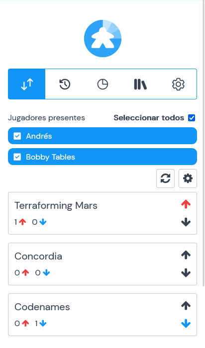

# Poll20

<p align="center">
    
</p>

<p align="center">
    Ash + Phoenix + Vue board game voting and logging app
</p>

<p align="center">
    
    
    
    
    
    
</p>

## Dev environment (containers)
Requires podman + podman-compose (or docker compose).

```sh
podman-compose -f compose.dev.yaml up -d # postgres (:5432), phoenix (:4000), vite (:3333)
podman-compose -f compose.dev.yaml logs -f app
podman-compose -f compose.dev.yaml exec app iex -S mix # or: run --rm app mix test
podman-compose -f compose.dev.yaml down # add -v to also wipe db/deps/_build/node_modules
```

Web on http://localhost:3333, backend on :4000.

## Server
Regular Phoenix server https://hexdocs.pm/phoenix/up_and_running.html + Ash https://www.ash-hq.org/docs/guides/ash/latest/tutorials/get-started (+ AshJsonApi + AshPostgres)

## Client
Vue3 + Vite app (Vitesse starter template). Lives on `assets/`, compiles to `priv/static`.